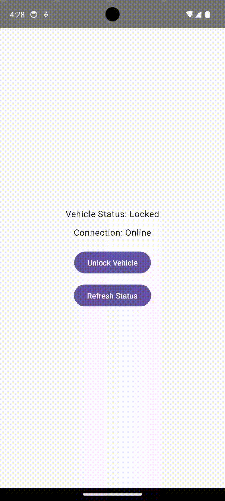

# VehicleControlApp

A full-stack vehicle control system that simulates a mobile vehicle management application. The project demonstrates communication between an Android client, backend API service, vehicle state simulation, automated testing, and CI pipeline integration.

## Demo

<table>
<tr>
<td align="center"><b>Normal Vehicle Control</b></td>
<td align="center"><b>Offline Handling</b></td>
<td align="center"><b>Timeout Recovery</b></td>
</tr>

<tr>
<td>

</td>

<td>

</td>

<td>

</td>
</tr>
</table>

## Overview

VehicleControlApp simulates a real-world vehicle control workflow:

- Android mobile application sends vehicle commands
- Backend service processes commands through REST APIs
- Vehicle simulator maintains vehicle state
- Automated tests validate application behavior
- GitHub Actions ensures continuous integration

Example workflow:

```
Android App
    |
    | Retrofit REST API
    |
FastAPI Backend
    |
    |
Vehicle Simulator
    |
Vehicle State
```

---

## Features

### Mobile Application

Built with Kotlin and Jetpack Compose.

Supported operations:

- View vehicle status
- Check vehicle connectivity
- Lock vehicle
- Unlock vehicle
- Display command processing status
- Handle offline vehicle scenarios
- Handle command timeout failures


### Backend Service

Built with FastAPI.

Provides REST APIs for:

- Vehicle status retrieval
- Vehicle connectivity updates
- Sending vehicle commands
- Tracking command execution status


Example API workflow:

```
POST /vehicles/vehicle-001/commands

{
    "command_type": "UNLOCK"
}
```

Backend returns a command ID and processes the command asynchronously.

---

## Architecture

```
+-----------------------+
| Android Application   |
| Kotlin + Compose      |
+-----------+-----------+
            |
            |
        Retrofit API
            |
            |
+-----------v-----------+
| FastAPI Backend       |
| REST API Service      |
+-----------+-----------+
            |
            |
+-----------v-----------+
| Vehicle Simulator     |
| Vehicle State Model   |
+-----------------------+
```

---

## Testing

The project includes multiple testing layers.

### Backend Testing

Framework:

- pytest

Tests cover:

- API endpoints
- Vehicle state management
- Command execution behavior
- Offline vehicle handling


### Android Unit Testing

Framework:

- JUnit
- Kotlin Coroutines Test

Tests cover:

- Repository logic
- ViewModel state updates
- Command handling


### Android Instrumentation Testing

Framework:

- Jetpack Compose UI Testing

Tests cover:

- Vehicle screen rendering
- User interaction flow
- End-to-end command scenarios


---

## Continuous Integration

GitHub Actions automatically runs validation after every push.

CI pipeline:

```
Git Push
    |
    v
GitHub Actions
    |
    +----------------+
    |                |
    v                v
Backend Tests   Android Build
pytest          Gradle Test
                |
                v
          APK Build Verification
```

Successful checks:

- Backend pytest
- Android unit tests
- Android build verification


---

## Tech Stack

### Android

- Kotlin
- Jetpack Compose
- ViewModel
- Retrofit
- Coroutines
- JUnit


### Backend

- Python
- FastAPI
- Pydantic
- pytest


### DevOps

- GitHub Actions
- Gradle
- Git


---

## Project Structure

```
VehicleControlApp/

├── app/
│   ├── Android application
│   ├── UI components
│   ├── ViewModel
│   ├── Repository
│   └── Tests
│
├── backend/
│   ├── FastAPI service
│   └── pytest tests
│
├── .github/
│   └── workflows/
│       └── ci.yml
│
└── gradle/
```

---

## Future Improvements

Possible extensions:

- Vehicle charging control
- Climate control
- User authentication
- Cloud deployment
- Real vehicle API integration
